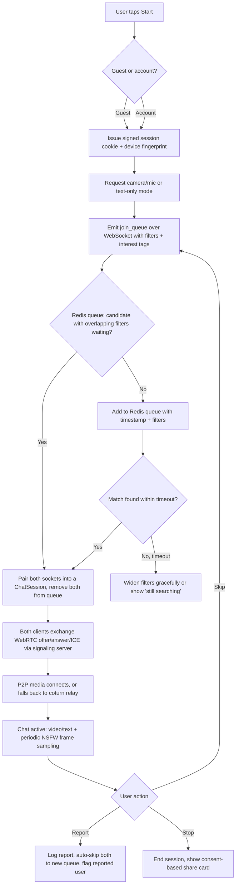
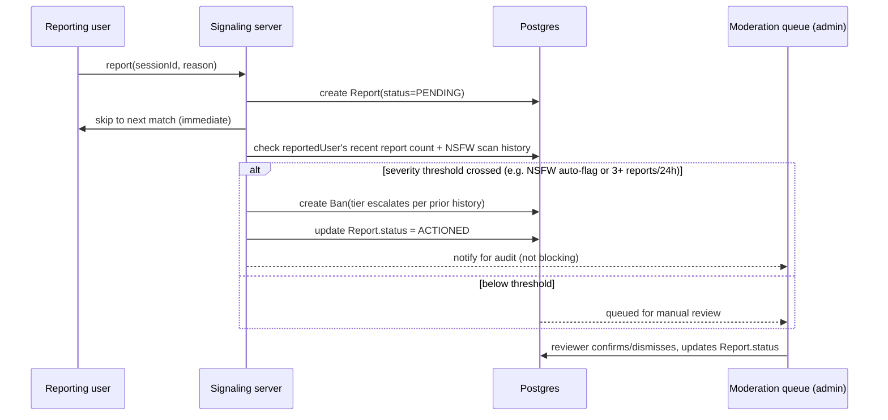
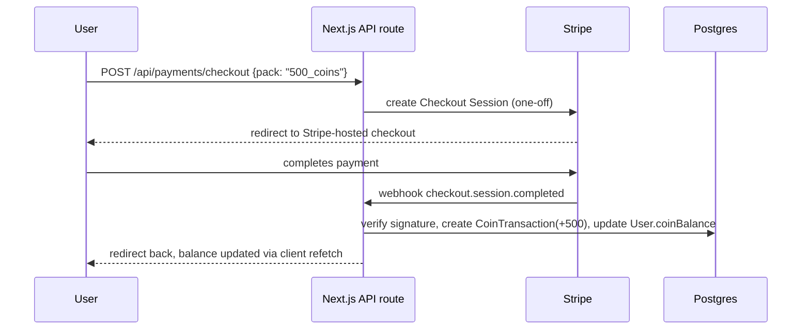
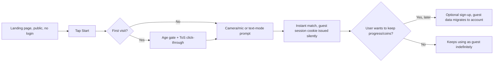

# Bounce — Functional Specification Document

Companion to `docs/PRD.md` (what & why). This document is the how: architecture, data model, contracts, and flows. Read PRD §6 (Trust & Safety) before touching matchmaking or media code — those constraints shape almost every decision below.

## 1. Tech stack decision

**Next.js 14 (App Router) + TypeScript, single deployable Node process.** Rationale against the alternatives:

- The user's stated goal is one full-stack codebase, no dual servers, low budget, solo dev. Next.js gives pages, API routes, and the marketing site in one repo/one deploy.
- **The one honest caveat:** WebRTC signaling (offer/answer/ICE exchange) and the matchmaking queue need a *persistent* connection (WebSocket), which a serverless/edge Next.js API route cannot hold open. The fix that keeps this a single deployable without adding a second service: run Next.js under a **custom Node server** (`server.ts`) that attaches a `socket.io` (or plain `ws`) server to the same HTTP server Next.js uses. One process, one PM2 entry, one port behind Nginx — satisfies "no dual servers" in every sense that matters operationally, even though internally there are two logical concerns (HTTP + WS) sharing one process.
- Everything else (auth, Stripe webhooks, coin ledger, admin dashboard, moderation queue, marketing pages) is plain Next.js API routes / Server Actions.

Stack:
- **Framework**: Next.js 14 App Router, TypeScript, custom server for Socket.io
- **DB**: Postgres (via Prisma ORM). Start on the same VPS (Docker or native install) — no need for a managed DB service at this scale.
- **Cache/queue/presence**: Redis — matchmaking queue, online presence, rate limiting. Runs on the same VPS.
- **Media**: WebRTC, peer-to-peer by default; **coturn** (open-source TURN/STUN server) self-hosted on the same VPS as a relay fallback for the ~15–20% of users behind restrictive NATs who can't connect P2P.
- **Auth**: NextAuth (email magic link + Google OAuth), fully optional — guest sessions use a signed httpOnly cookie + Redis-backed session, no account required.
- **Payments**: Stripe (Checkout + Customer Portal for subscriptions, one-off Checkout for coin packs), behind a `PaymentProvider` interface so it's swappable.
- **Moderation**: open-source NSFW image classifier (TF.js-compatible, e.g. an NSFW.js-style MobileNet model) run server-side against periodic decoded frame snapshots — never full video storage.
- **Styling/UI**: Tailwind CSS + Framer Motion for the animated glass/gradient background and micro-interactions (see PRD-adjacent UI direction in the artifact/README).
- **Infra**: single VPS, Docker Compose (app, Postgres, Redis, coturn, Nginx), Cloudflare in front (DNS + DDoS + CDN), Certbot/Let's Encrypt via Nginx, PM2 or the Docker restart policy for process supervision. No CI/CD pipeline per explicit instruction — deploy is a `git pull && docker compose up -d --build` on the box, documented as a runbook.

## 2. Why one VPS is enough at launch

Video does **not** flow through the app server in the common case — it's P2P over WebRTC. The VPS only carries: the Next.js app, WebSocket signaling (tiny JSON messages), Postgres, Redis, and the TURN relay (only for the NAT-restricted minority, and only for the duration of their call). A $6–12/mo 2vCPU/4GB box comfortably handles low-hundreds of concurrent users under this model. The first thing to scale, when needed, is TURN relay bandwidth — move it to a bigger box or a dedicated relay host before anything else. Document this as the single scaling trigger to watch (PRD §9).

## 3. Data model (Prisma sketch)

```prisma
model User {
  id            String   @id @default(cuid())
  email         String?  @unique
  displayName   String?
  avatarUrl     String?
  isGuest       Boolean  @default(true)
  deviceFingerprint String? // set even for guests, used for ban/rate-limit continuity
  coinBalance   Int      @default(20) // small starting grant, see PRD growth notes
  role          Role     @default(USER) // USER | MODERATOR | ADMIN
  subscription  Subscription?
  createdAt     DateTime @default(now())
  bans          Ban[]
  reportsFiled  Report[] @relation("ReportsFiled")
  reportsAgainst Report[] @relation("ReportsAgainst")
  sessions      ChatSession[] @relation("SessionUserA")
  sessions2     ChatSession[] @relation("SessionUserB")
}

model Subscription {
  id            String   @id @default(cuid())
  userId        String   @unique
  user          User     @relation(fields: [userId], references: [id])
  stripeCustomerId String
  stripeSubId   String
  status        String   // active | past_due | canceled
  currentPeriodEnd DateTime
}

model ChatSession {
  id            String   @id @default(cuid())
  userAId       String
  userBId       String?  // null while waiting in queue
  userA         User     @relation("SessionUserA", fields: [userAId], references: [id])
  userB         User?    @relation("SessionUserB", fields: [userBId], references: [id])
  mode          SessionMode // VIDEO | TEXT
  interestTagsMatched String[]
  startedAt     DateTime @default(now())
  endedAt       DateTime?
  endReason     String?  // skip | report | disconnect | error
}

model Report {
  id            String   @id @default(cuid())
  sessionId     String
  reporterId    String
  reportedId    String
  reporter      User     @relation("ReportsFiled", fields: [reporterId], references: [id])
  reported      User     @relation("ReportsAgainst", fields: [reportedId], references: [id])
  reason        ReportReason // NUDITY | HARASSMENT | MINOR_SUSPECTED | SPAM | OTHER
  snapshotHash  String?  // hash of the moderation snapshot, never the raw image, unless retained briefly for active review per runbook
  status        ReportStatus @default(PENDING) // PENDING | ACTIONED | DISMISSED
  createdAt     DateTime @default(now())
}

model Ban {
  id            String   @id @default(cuid())
  userId        String?
  deviceFingerprint String?
  ipHash        String?  // hashed, not raw IP, at rest
  reason        String
  tier          BanTier  // WARN | HOUR | DAY | WEEK | PERMANENT
  expiresAt     DateTime?
  createdAt     DateTime @default(now())
}

model CoinTransaction {
  id            String   @id @default(cuid())
  userId        String
  delta         Int      // positive = purchase/reward, negative = spend
  reason        String   // stripe_purchase | gender_filter | gift_sent | referral_bonus | daily_streak
  stripePaymentId String?
  createdAt     DateTime @default(now())
}

model Referral {
  id            String   @id @default(cuid())
  referrerId    String
  refereeId     String   @unique
  rewardedAt    DateTime?
}
```

## 4. Matchmaking flow



## 5. WebRTC signaling contract (Socket.io events)

| Event | Direction | Payload | Purpose |
|---|---|---|---|
| `join_queue` | client → server | `{ mode, interestTags[], filters }` | Enter matchmaking |
| `leave_queue` | client → server | `{}` | Cancel search |
| `matched` | server → client | `{ sessionId, peerMeta, isInitiator }` | Pairing found, one side is designated initiator for the SDP offer |
| `signal` | bidirectional (relayed) | `{ sessionId, type: 'offer'\|'answer'\|'ice-candidate', payload }` | Opaque WebRTC signaling relay, server never inspects contents |
| `skip` | client → server | `{ sessionId }` | End current session, immediately re-`join_queue` |
| `report` | client → server | `{ sessionId, reason }` | Create `Report`, then behaves like `skip` |
| `session_ended` | server → client | `{ sessionId, reason }` | Peer left/disconnected/was banned |
| `moderation_flag` | server → client | `{ severity: 'warn'\|'ban' }` | Result of a frame-sampling check on the recipient's own outgoing stream |

The server is a **pure signaling relay** for `signal` payloads — it never decodes or stores SDP/ICE contents. Moderation frame sampling is a *separate* channel: the client periodically (e.g. every 15–20s, jittered) posts a downscaled JPEG snapshot of its own outgoing video to a `POST /api/moderation/scan` REST endpoint for classification, then discards it server-side immediately after scoring (store only the resulting score + a hash, per PRD §6).

## 6. Report → ban flow



Escalation ladder (device fingerprint + IP + account, whichever are known): **warn → 1 hour → 24 hours → 7 days → permanent**, resetting only on a clean 30-day window post-warning. Suspected-minor or confirmed-CSAM reports skip the ladder entirely and go straight to permanent ban + the NCMEC reporting runbook (§9).

## 7. Payment flows

### 7.1 Coin pack purchase



### 7.2 Bounce+ subscription

Same shape via Stripe Checkout in `subscription` mode; webhook handlers for `customer.subscription.updated` / `.deleted` keep `Subscription.status` in sync, gating ad-free + filter access by reading that status at request time (never trust client-side state for entitlements).

All Stripe logic lives behind a `PaymentProvider` interface (`createCheckoutSession`, `handleWebhook`, `getEntitlements(userId)`) so the rest of the app never imports the Stripe SDK directly — keeps payments testable and swappable per PRD §7.

## 8. Onboarding / guest-first flow



Public-under-login requirement from the brief: the marketing/landing page, ToS, and the matching flow itself are all reachable with zero authentication — accounts exist only to persist state across devices/sessions, never as a gate to the core loop.

## 9. Operations runbook notes (keep this short and real, not aspirational)

- **NCMEC reporting**: any report tagged `MINOR_SUSPECTED` or a moderation snapshot scored as suspected CSAM is escalated manually by the operator (you) following NCMEC's CyberTipline process (report.cybertip.org) — this is a legal obligation for US-facing platforms, document the actual step-by-step once the reporting account is set up, before public launch.
- **Backups**: nightly `pg_dump` to encrypted off-box storage (even a cheap object storage bucket) — the only stateful thing on the VPS that isn't reconstructable.
- **Deploy**: `git pull`, `docker compose build`, `docker compose up -d`, run pending Prisma migrations — documented as a checklist, not automated, per "no CI/CD" instruction.
- **Monitoring**: uptime check (free tier of an external ping service) + VPS resource alerts; skip anything heavier at this scale.

## 10. Open questions to confirm before Phase 1 build

1. Final brand name/domain (PRD §1 lists the working name + backups).
2. Ad network choice — depends on approval requirements for adult-adjacent-but-SFW content; verify a network will accept a stranger-chat app before building the integration.
3. Starting coin grant + coin pack pricing — needs a couple of comparable-app data points before locking numbers.
